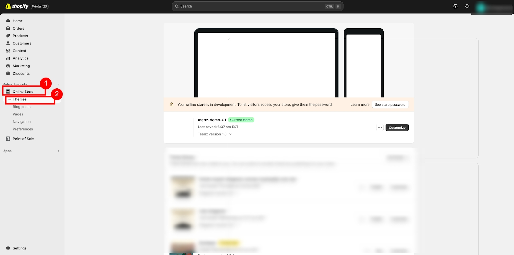
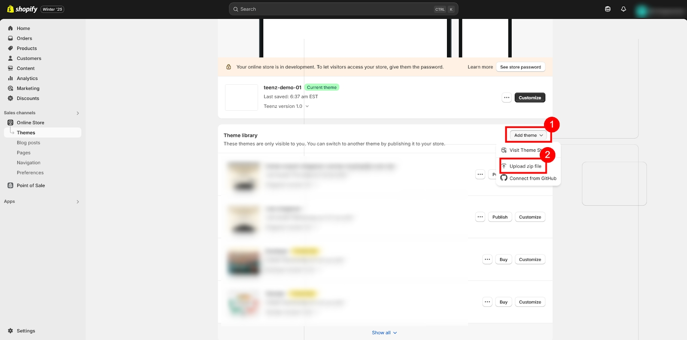
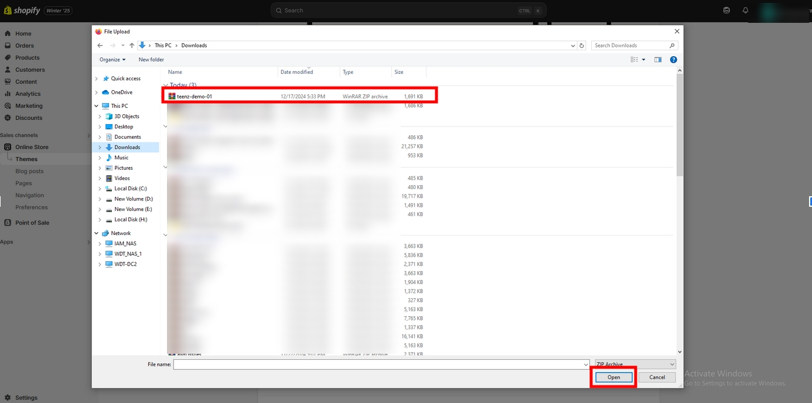
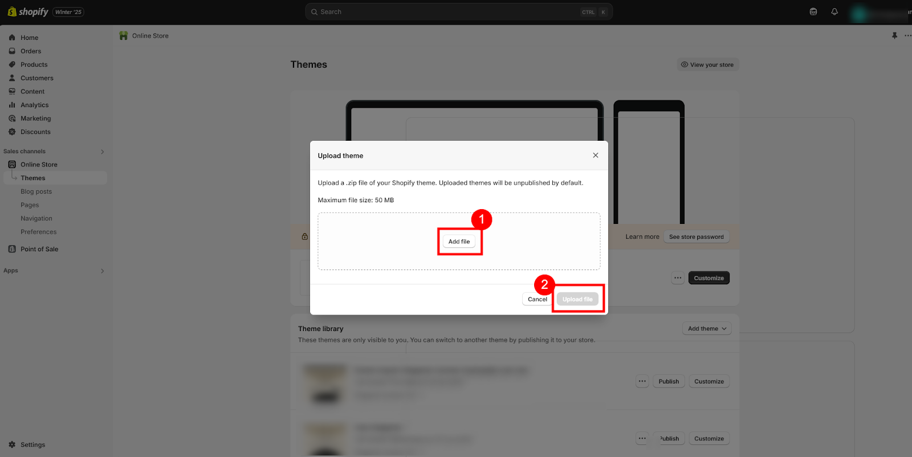
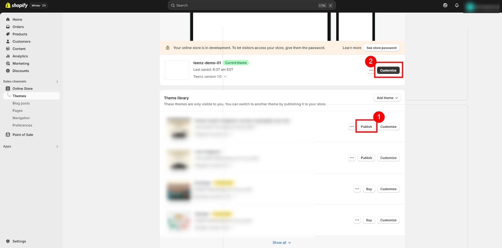

# Installation

#### **Log in to Your Shopify Admin:** 

1. Go to your Shopify store's admin page
2. Log in with your username and password.

#### **Navigate to the Themes Page:** 

* In Admin panel, click on _**Online Store > Themes.**_

#### **Upload the Theme:** 

1. Navigate to _**Online store > Themes > Add theme**_
2. Select _**Upload ZIP file**_ from the dropdown menu.

1. A file upload dialog will appear. Click _**Choose File**_
2. Select the theme _**.zip**_ file from your computer.

1. Now, just click _**'Upload'**_ to continue.

#### **Publish the Theme:** 

1. Once the upload is complete, the theme will appear in your _**"Theme library"**_ on the Themes page.
2. Click on _**Publish > Theme to Live**._
3. To start customizing, click on the Customize button next to your respective theme.

